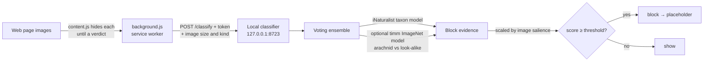

# ImgEdge

[](https://app.codspeed.io/mcb0035/imgedge?utm_source=badge)
[](https://scorecard.dev/viewer/?uri=github.com/mcb0035/imgedge)
[](https://www.bestpractices.dev/projects/13448)

A minimal Microsoft Edge / Chromium (Manifest V3) extension that intercepts the
images on every page, classifies each one with a **local** model, and hides the
ones you don't want to see — so you can keep a category of image (by default
**arachnids**) from ever showing, without leaking your browsing to a cloud
service.

Built for a specific goal: keep images of a chosen category (by default
**arachnids**) out of sight — for comfort, phobia, or focus — using a local
model. Nothing about image content ever leaves your machine.



## How it works

1. **Content script** ([content.js](content.js)) runs at `document_start` in
   every frame. It finds every visible image surface — `` (incl.
   `<picture>`/`srcset`), `<input type="image">`, SVG `<image>`, `<video poster>`,
   and CSS `background-image` / `list-style-image` — hides each one via CSS until
   a verdict arrives, then reveals it or replaces it with a clickable "blocked"
   placeholder. Tiny/decorative images (icons, tracking pixels) are skipped.
2. **Background worker** ([background.js](background.js)) owns settings and the
   allow/block lists, draws the toolbar badge + health state, wires the
   right-click menu, and forwards each image URL to the local classifier with a
   shared token.
3. **Local classifier** ([src/imgedge/classifier/server.py](src/imgedge/classifier/server.py))
   decodes each image once and runs a **voting ensemble** ([src/imgedge/voters/](src/imgedge/voters/)):
   - the **iNaturalist** taxon model blocks when the predicted taxon descends
     from the target (default **Arachnida** — spiders, scorpions, ticks, mites…);
   - an optional second **timm / ImageNet** voter adds *signed* evidence — it
     pushes toward a block when it recognizes a real arachnid and *against* one
     when it sees a mere look-alike (other insects, webs, geometric patterns,
     drawings);
   - the combined evidence is scaled by **image salience** so large, detailed,
     photorealistic images block more readily than tiny, flat, or fleeting ones.

## Project layout

| Path | What it is |
|------|------------|
| `extension/` (`manifest.json`, `background.js`, `content.js`, `content.css`, `popup.*`, `icons/`) | The browser extension (the load-unpacked target) |
| `src/imgedge/classifier/server.py` | Local HTTP classifier (`/classify`, `/health`) |
| `src/imgedge/voters/` | Voting ensemble: base classes, iNaturalist + timm voters, image-salience weighting |
| `src/imgedge/inat/` | iNaturalist model: download, TFLite + ONNX backends, taxonomy filter |
| `tests/` | pytest suite (SSRF, integrity, cache, voting, salience, decode sandbox, perf guards) + `tests/js/` node:test extension tests |
| `benchmark/` | Decode-latency + memory-footprint scripts, plus the CodSpeed suite (`pytest benchmark/ --codspeed`) — see [benchmark/README.md](benchmark/README.md) |
| `training/` | **Optional / not used by default** — a from-scratch MobileNetV3 fine-tune pipeline |
| `package.ps1` | Build a store-ready ZIP (and optional `.crx`) of the extension |

## Documentation

- **[Developer guide](docs/development.md)** — set up, build, test, and benchmark
  ImgEdge from source.
- **[Interface reference](docs/api.md)** — the local HTTP API (`/classify`,
  `/health`) and the CLI, with request/response schemas.
- **[Configuration reference](docs/configuration.md)** — every popup setting and
  `IMGEDGE_*` environment variable.
- **[Evaluation & profiling](docs/evaluation.md)** — measure recall / FPR and
  decision latency of the voting ensemble.
- **[Threat model](docs/threat-model.md)** — STRIDE + LINDDUN analysis.
- **[Security policy](SECURITY.md)** · **[Privacy](PRIVACY.md)** ·
  **[Contributing](CONTRIBUTING.md)**

## Quick start

```powershell
# 1. Install the classifier (CPU baseline: numpy, pillow, ai-edge-litert)
pip install -e .

# 2. Download + verify the iNaturalist vision model + taxonomy (~21 MB)
imgedge-download-models

# 3. Start the classifier — it prints an access token
imgedge-server

# 4. Load the extension: edge://extensions → Developer mode → Load unpacked → the extension/ folder
# 5. Open the ImgEdge popup, paste the token into "Server token", Save.
```

> Commands are shown for PowerShell; on bash/zsh use `source .venv/bin/activate`
> and `export VAR=…`. The whole toolchain is FLOSS — see the
> [developer guide](docs/development.md).

Browse — arachnid images are hidden. The toolbar badge shows the blocked count;
its tooltip and the popup show classifier health.

## Optional: GPU / NPU acceleration

The model is tiny, so the CPU pool is usually plenty. To offload to the Intel
NPU (default), a GPU, etc.:

```powershell
# one-time: convert the bundled TFLite model to ONNX (tf2onnx needs TensorFlow)
pip install tf2onnx onnx tensorflow
python -m imgedge.inat.convert_to_onnx          # writes the .onnx next to the model

# runtime: install ONE ONNX Runtime build for your accelerator, then start the server
pip install onnxruntime-openvino                # Intel NPU / GPU (OpenVINO)
imgedge-server                                  # auto-prefers ONNX; prints the provider
```

The server picks a provider in this order by default: **NPU (OpenVINO)** → GPU
→ CPU. Force one with `IMGEDGE_EP=npu|ovgpu|cuda|dml|cpu`. Install a single
matching runtime: `onnxruntime-openvino` (Intel NPU/GPU), `onnxruntime-directml`
(any DX12 GPU), `onnxruntime-gpu` (NVIDIA CUDA), or plain `onnxruntime` via
`pip install -e ".[onnx]"` (CPU).

## Voting ensemble (optional second model)

The classifier combines one or more voters ([src/imgedge/voters/](src/imgedge/voters/)) under the
default **`evidence`** policy: each voter contributes a *signed* score, the
positive part is scaled by image salience, and the image is blocked when the
total crosses the threshold.

- **iNaturalist voter** (always on) — the taxon model described above.
- **timm / ImageNet voter** (optional) — `mobilenetv3_large_100.ra_in1k`. It
  sums probability over real arachnid classes (push *toward* a block) minus
  look-alike classes — other insects/arthropods, webs, geometric patterns,
  drawings (push *against*). Enable it with:

  ```powershell
  pip install -e ".[voters]"   # timm + torch (uses CUDA if present)
  ```

  Without these packages the voter is skipped and the ensemble runs
  iNaturalist-only.

- **Image salience** scales the positive evidence into `[0.35 … 1.30]`: larger,
  more detailed / photorealistic, foreground `` images block more readily;
  small, flat or stylized, and "fleeting" (video poster / CSS background) images
  are weighted down. The content script reports each image's rendered size and
  surface kind for this.

Tune with the `IMGEDGE_VOTE` / `IMGEDGE_TIMM_*` variables below, or edit the
block / contrast term lists in [src/imgedge/voters/timm_voter.py](src/imgedge/voters/timm_voter.py).

## Configuration

ImgEdge is configured in the extension **popup** (per-browser: the **Detection
mode** preset, endpoint + token, fail-closed / strict toggles, CSS-background
scanning, the live **Block threshold** / **Salience weighting** sliders, and the
allow/block lists) and via
**`IMGEDGE_*` environment variables** on the server (target taxon, thresholds,
the optional voters, ONNX provider, fetch/SSRF limits, sandbox, and the
token/cache/log paths).

See the **[configuration reference](docs/configuration.md)** for every popup
setting and environment variable, and the **[interface reference](docs/api.md)**
for the HTTP API those values shape.

## Security model

- **Local only.** Image content never leaves the machine; the server binds to
  `127.0.0.1`.
- **Token auth.** `/classify` requires `X-ImgEdge-Token` (the extension sends it;
  paste it once into the popup). `/health` is open so the popup can report status.
- **No CORS.** The server sends no `Access-Control-*` headers, so arbitrary web
  pages can't call it; the extension reaches it via host permissions.
- **SSRF-guarded fetch.** When the server fetches an image URL it allows only
  `http(s)`, refuses loopback / private / link-local / CGNAT / reserved targets
  (unwrapping IPv4-mapped and NAT64 IPv6), **pins the connection to the validated
  IP** (no DNS-rebinding window), follows no redirects, restricts ports (default
  `80,443`), rejects non-image responses, and caps per-host concurrency.
  `IMGEDGE_FETCH_HTTPS_ONLY` and `IMGEDGE_FETCH_ALLOW_HOSTS` can lock egress down
  further.
- **Decode hardening.** Pillow is capped to a max pixel count (decompression-bomb
  guard) and only parses an allowlist of raster formats.
- **Optional decode isolation.** `IMGEDGE_SANDBOX=1` runs the Pillow decode in a
  recycled subprocess pool; on Windows, `IMGEDGE_SANDBOX_APPCONTAINER=1` runs
  each worker in a capability-less AppContainer that denies the decoder network
  and writes to your files. Both are off by default — **recommended when
  distributing to others or browsing untrusted sites** — see [SECURITY.md](SECURITY.md).
- **Pinned model integrity.** Each downloaded asset is verified against a pinned
  SHA-256; the server refuses to load a model/taxonomy that doesn't match.
- **Bounded inputs.** `/classify` rejects bodies over 16 MB, images cap at 8 MB,
  and the logfile is size-capped + rotated (and never records the token).
- **Fail-open by default.** If the classifier is down or the model isn't loaded,
  images are shown (toggle *Block when classifier unreachable* / Strict mode to
  flip this). The toolbar badge turns into a grey `!` when the classifier is
  broken so "not filtering" looks different from "nothing matched".

## Packaging for distribution

[`package.ps1`](package.ps1) stages only the extension front-end (the Python
server, training assets, and docs are excluded) and builds a store-ready ZIP:

```powershell
.\package.ps1          # -> dist\imgedge-<version>.zip  (Chrome Web Store / Edge Add-ons)
.\package.ps1 -Crx     # also dist\imgedge.crx (+ dist\imgedge.pem on first run)
```

Upload the ZIP to the [Chrome Web Store](https://chrome.google.com/webstore/devconsole)
or [Edge Add-ons](https://partner.microsoft.com/dashboard/microsoftedge). For a
self-hosted `.crx`, keep `imgedge.pem` secret and reuse it for every update so
the extension ID stays stable (`dist/`, `*.crx`, `*.pem` are git-ignored).

> The extension needs the local classifier running and the token pasted into the
> popup, so it isn't functional on its own — note that for anyone you share the
> package with.

## Limitations

- Images in the initial HTML may be fetched by the browser's preload scanner
  before the script reaches them; display is always prevented, but truly
  stopping those bytes would need `declarativeNetRequest` (which can't consult an
  async classifier).
- The iNaturalist model only recognizes organisms, so non-creature images score
  ≈ 0 — good for precision, but verify preprocessing/threshold for your needs
  (`python -m imgedge.inat.inat_vision <photo>` ranks the top taxa).
- Dynamic backgrounds swapped in later (via JS class/style changes) aren't
  re-scanned, to avoid the CPU storm that pegging on those mutations caused.

## Privacy

ImgEdge runs entirely on your machine — no servers, accounts, analytics, or
tracking. Image content and browsing are classified locally; only a block/allow
verdict crosses the local socket. See [PRIVACY.md](PRIVACY.md) for the full
disclosure (including the one-time model download and the classification fetch).

## Contributing

Bug reports, feature ideas, and pull requests are welcome — see
[CONTRIBUTING.md](CONTRIBUTING.md) for how to get the code, give feedback, and
the standards a change has to meet. Security issues go through
[private reporting](https://github.com/mcb0035/imgedge/security/advisories/new)
(see [SECURITY.md](SECURITY.md)), not public issues.

## License

ImgEdge is licensed under the [Apache License 2.0](LICENSE) — © 2026 Matthew Bedford.

The machine-learning models are **downloaded at runtime, not bundled in this
repo**, and each remains under its own license (iNaturalist — MIT; timm —
Apache-2.0). See [THIRD-PARTY-NOTICES.md](THIRD-PARTY-NOTICES.md) for attributions
and — before you add another model — the **license checklist** there (which model
licenses are allowed vs off-limits, and the commercial-use / training-data
pitfalls to watch for).
