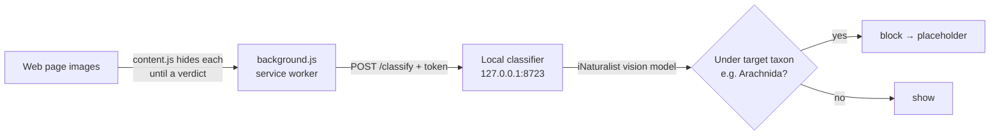

# ImgEdge

A minimal Microsoft Edge / Chromium (Manifest V3) extension that intercepts the
images on every page, classifies each one with a **local** model, and hides the
ones you don't want to see — so you can keep a category of image (by default
**arachnids**) from ever showing, without leaking your browsing to a cloud
service.

Built for a specific goal: *block all images of a chosen type using a local
model so you don't pollute your ads/recommendations.* Nothing about image
content ever leaves your machine.



## How it works

1. **Content script** ([content.js](content.js)) runs at `document_start` in
   every frame. It finds every visible image surface — `` (incl.
   `<picture>`/`srcset`), `<input type="image">`, SVG `<image>`, `<video poster>`,
   and CSS `background-image` / `list-style-image` — hides each one via CSS until
   a verdict arrives, then reveals it or replaces it with a clickable "blocked"
   placeholder. Tiny/decorative images (icons, tracking pixels) are skipped.
2. **Background worker** ([background.js](background.js)) owns settings and the
   allow/block lists, draws the toolbar badge + health state, wires the
   right-click menu, and forwards each image URL to the local classifier with a
   shared token.
3. **Local classifier** ([classifier/server.py](classifier/server.py)) runs the
   iNaturalist vision model, walks the taxonomy, and returns `block: true` when
   the image's predicted taxon descends from the target (default **Arachnida** —
   spiders, scorpions, ticks, mites…).

## Project layout

| Path | What it is |
|------|------------|
| `manifest.json`, `background.js`, `content.js`, `content.css`, `popup.*` | The extension |
| `classifier/server.py` | Local HTTP classifier (`/classify`, `/health`) |
| `inat/` | iNaturalist model: download, TFLite + ONNX backends, taxonomy filter |
| `training/` | **Optional / not used by default** — a from-scratch MobileNetV3 fine-tune pipeline (an alternative to the iNaturalist model) |

## Quick start

```powershell
# 1. Install a model runtime (CPU baseline)
pip install -r inat/requirements.txt
pip install tensorflow            # or: pip install ai-edge-litert

# 2. Download the iNaturalist vision model + taxonomy (~21 MB)
python inat/download_models.py

# 3. Start the classifier — it prints an access token
python classifier/server.py

# 4. Load the extension: edge://extensions → Developer mode → Load unpacked → this folder
# 5. Open the ImgEdge popup, paste the token into "Server token", Save.
```

Browse — arachnid images are hidden. The toolbar badge shows the blocked count;
its tooltip and the popup show classifier health.

## Optional: GPU / NPU acceleration

The model is tiny, so the CPU pool is usually plenty. To offload to the Intel
NPU (default), a GPU, etc.:

```powershell
pip install tf2onnx onnx onnxruntime-openvino   # NPU/GPU via OpenVINO
python inat/convert_to_onnx.py                  # TFLite → ONNX
python classifier/server.py                     # auto-prefers ONNX; prints provider
```

The server picks a provider in this order by default: **NPU (OpenVINO)** → GPU
→ CPU. Force one with `IMGEDGE_EP=npu|ovgpu|cuda|dml|cpu`. Other runtimes:
`onnxruntime-directml` (any DX12 GPU) or `onnxruntime-gpu` (NVIDIA CUDA).

## Configuration

**Popup (per-browser):** enable/disable, classifier endpoint + token, *Send
image bytes* (for cookie/LAN-gated images), *Block when classifier unreachable*
(fail-closed), *Strict mode* (block until explicitly allowed), *Scan CSS
backgrounds*, and the whitelist / allowed-sites / blocklist.

**Server (environment variables):**

| Variable | Default | Purpose |
|----------|---------|---------|
| `IMGEDGE_TARGET` | `Arachnida` | Taxon to block (any iNaturalist name, e.g. `Araneae` for spiders only) |
| `IMGEDGE_THRESHOLD` | `0.5` | Block when P(target) ≥ this |
| `IMGEDGE_EP` | `auto` | ONNX provider: `auto\|npu\|ovgpu\|cuda\|dml\|cpu` |
| `IMGEDGE_POOL` | `min(4, cpus)` | TFLite interpreter pool size |
| `IMGEDGE_WORKERS` | `8` | Max concurrent HTTP request workers |
| `IMGEDGE_TOKEN` / `IMGEDGE_TOKEN_FILE` | generated → `~/.imgedge_token` | Access token |
| `IMGEDGE_CACHE_FILE` | `~/.imgedge_cache.json` | Verdict cache (`none` to disable) |
| `IMGEDGE_MODEL` / `IMGEDGE_ONNX` / `IMGEDGE_TAXONOMY` | under `inat/models/` | Model/taxonomy paths |

## Security model

- **Local only.** Image content never leaves the machine; the server binds to
  `127.0.0.1`.
- **Token auth.** `/classify` requires `X-ImgEdge-Token` (the extension sends it;
  paste it once into the popup). `/health` is open so the popup can report status.
- **No CORS.** The server sends no `Access-Control-*` headers, so arbitrary web
  pages can't call it; the extension reaches it via host permissions.
- **SSRF-guarded fetch.** When the server fetches an image URL it refuses
  loopback / private / link-local / reserved targets and follows no redirects.
- **Decode hardening.** Pillow is capped to a max pixel count (decompression-bomb
  guard) and only parses an allowlist of raster formats.
- **Fail-open by default.** If the classifier is down or the model isn't loaded,
  images are shown (toggle *Block when classifier unreachable* / Strict mode to
  flip this). The toolbar badge turns into a grey `!` when the classifier is
  broken so "not filtering" looks different from "nothing matched".

## Limitations

- Images in the initial HTML may be fetched by the browser's preload scanner
  before the script reaches them; display is always prevented, but truly
  stopping those bytes would need `declarativeNetRequest` (which can't consult an
  async classifier).
- The iNaturalist model only recognizes organisms, so non-creature images score
  ≈ 0 — good for precision, but verify preprocessing/threshold for your needs
  (`python inat/inat_vision.py <photo>` ranks the top taxa).
- Dynamic backgrounds swapped in later (via JS class/style changes) aren't
  re-scanned, to avoid the CPU storm that pegging on those mutations caused.
