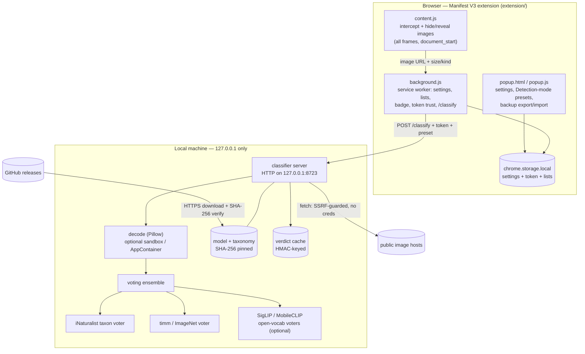

# ImgEdge architecture

The high-level ("10,000-foot") design of ImgEdge: a Manifest V3 browser
extension plus a **local, on-device** image classifier that hides images of a
chosen category (default: **Arachnida**) without any image content or browsing
data leaving the machine.

For depth, see the [interface reference](api.md) (HTTP/CLI contract), the
[configuration reference](configuration.md) (every knob), the
[threat model](threat-model.md) (STRIDE/LINDDUN + trust boundaries), and the
[developer guide](development.md).

## Design goals

- **Private by design** — image content and browsing URLs never leave the
  machine; only a block/allow verdict crosses a loopback socket.
- **Fail toward comfort** — each image is hidden until a verdict arrives
  (configurable fail-open / fail-closed / strict).
- **Layered, swappable detection** — a voting ensemble of independent models,
  each contributing *signed* evidence, so no single model decides alone.
- **Minimal attack surface** — loopback-only server, token auth, SSRF-guarded
  fetch, hardened decode, no cloud dependency at runtime.

## Components

## The pieces

### Browser extension (`extension/`)

- **content.js** — runs at `document_start` in every frame. It finds every
  visible image surface (`` incl. `srcset`/`<picture>`,
  `<input type="image">`, SVG `<image>`, `<video poster>`, and CSS
  `background-image` / `list-style-image`), hides each until a verdict arrives,
  then reveals it or swaps in a clickable "blocked" placeholder. Tiny/decorative
  images are skipped. It uses `textContent` only — no `innerHTML` / `eval`.
- **background.js** (service worker) — owns settings, the
  whitelist / allowed-sites / blocklist, the toolbar badge, and health state. It
  verifies the server's identity (an HMAC challenge) **before** sending the token,
  then `POST`s each image URL (plus rendered size/kind and the chosen preset) to
  the classifier and applies the verdict. It ignores messages from other
  extensions.
- **popup** (`popup.html` / `popup.js`) — endpoint + token, the **Detection-mode
  presets** (Fast / Balanced / Accurate), tuning sliders, the allow/block lists,
  and settings **Backup** (export/import, token- and list-free). Settings and
  lists live in `chrome.storage.local` — local to the browser profile.

### Local classifier (`src/imgedge/classifier/`)

- **server.py** — a loopback-only HTTP server (`127.0.0.1:8723`).
  `POST /classify` (token-authenticated, constant-time compare) returns a
  block/allow verdict; `GET /health` reports liveness (and, with the token,
  configuration plus an HMAC identity proof). It uses a bounded worker pool, a
  per-connection read timeout, and sends no CORS headers.
- **image acquisition** — inline request bytes are used directly when present;
  otherwise the server fetches the URL through an **SSRF guard** (public IPs
  only, socket pinned to the validated IP, HTTPS certificate-verified, redirects
  refused, content-type and size capped) that sends **no credentials**.
- **decode** — Pillow decode behind a pixel cap + raster-format allowlist,
  optionally isolated in a recycled subprocess pool or a no-network Windows
  **AppContainer** (`IMGEDGE_SANDBOX` / `IMGEDGE_SANDBOX_APPCONTAINER`).

### Voting ensemble (`src/imgedge/voters/`)

The decoded image is scored once by several independent voters, each returning
**signed evidence** (positive pushes toward a block, negative argues against):

- **iNaturalist taxon voter** — blocks when the predicted taxon descends from the
  target (default Arachnida: spiders, scorpions, ticks, mites…).
- **timm / ImageNet voter** (optional) — positive evidence for a real arachnid,
  negative for a look-alike (other insects, webs, patterns, drawings).
- **SigLIP** and **MobileCLIP** open-vocabulary voters (optional) — free-text
  prompt matching, catching arachnids the closed-vocab models have no class for.

Under the default **evidence** policy the ensemble sums the weighted signed
evidence, scales the positive part by **image salience** (larger, more detailed
images block more readily), and blocks when the total crosses the threshold; a
confident iNaturalist match can override. The expensive open-vocab voters are
**deferred** — a cascade runs them only when the cheap voters leave the score
near the threshold. The popup's **presets** select a per-request voter subset
(Fast = iNat + timm, Balanced = + MobileCLIP, Accurate = + SigLIP). Each optional
voter activates only when its dependency extra is installed.

### Models (`src/imgedge/inat/`)

The iNaturalist vision model (TFLite by default; optional ONNX for GPU/NPU) and
taxonomy are downloaded from GitHub over HTTPS and **SHA-256 pinned** — verified
on download *and* before load, so a tampered or truncated file is refused.

## Request → verdict lifecycle

1. `content.js` sees an image, hides it, and asks `background.js` for a verdict
   (URL + rendered size/kind).
2. `background.js` checks the local allow/block lists, then (if undecided) calls
   `POST /classify` on the loopback server with the token and the active preset.
3. The server authenticates the token, acquires the bytes (inline or
   SSRF-guarded fetch), and decodes once.
4. The voting ensemble scores the image — cascading to the deferred voters only
   when needed — and returns `{ block, reason, score }`.
5. `background.js` applies the verdict; `content.js` reveals the image or shows a
   placeholder. Verdicts are cached (HMAC-keyed by URL) so repeats are instant.

## Trust boundaries

- **Web page → extension** — pages are untrusted; `content.js` reads only image
  geometry and never injects page-controlled markup.
- **Extension → local server** — a shared token authorises `/classify`; the
  extension verifies the server's HMAC identity proof before disclosing the token
  (anti port-squatting).
- **Local server → internet** — only two egress paths exist: the pinned HTTPS
  model download (GitHub) and the SSRF-guarded public image fetch (no
  credentials). Image content is never uploaded anywhere.

See the [threat model](threat-model.md) for the STRIDE / LINDDUN analysis of each
boundary and the residual risks.

## Configuration & extension points

Behaviour is tuned per-browser in the popup and server-side via `IMGEDGE_*`
environment variables — see the [configuration reference](configuration.md). New
detectors implement the small `Voter` interface (`voters/base.py`) and join the
ensemble; optional voters activate when their dependency extra is installed, so
the detection stack scales from a single model to four without code changes.
