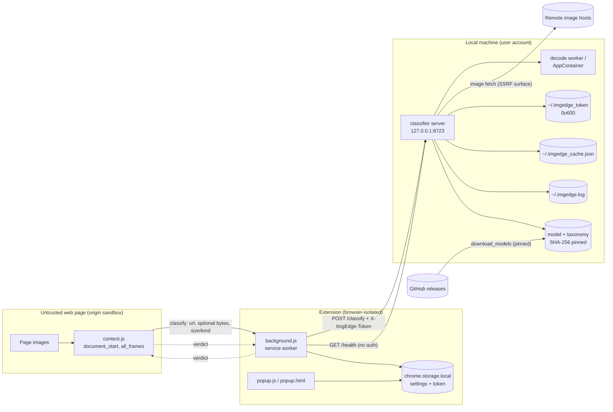

# ImgEdge Threat Model (STRIDE + LINDDUN)

> Status: living document. Last reviewed 2026-06-29; F1–F11 remediated on branch `feature/harden`.
> Not a guarantee of security; it records what we analysed and decided.

This applies Adam Shostack's **four-question** frame, models the system with a
data-flow diagram and trust boundaries, runs **STRIDE** (security) and
**LINDDUN** (privacy) over each element, and tracks findings to a remediation
table. Severity is qualitative (this is a single-user, loopback-bound tool, so
most network attack vectors are local-only); CVSS-style notes are given for the
notable items.

---

## 1. What are we building?

ImgEdge is a Manifest V3 browser extension plus a **local** Python classifier
(`127.0.0.1:8723`) that hides images of a chosen category (default: arachnids).
Design promise: **image content and browsing never leave the machine** — only a
block/allow verdict crosses the local socket.

### Components & data flows

### Trust boundaries
1. **Page → content.js** — the page DOM is fully attacker-controlled.
2. **Extension → local server** — process + **token** boundary over loopback HTTP.
3. **Server → network** — image fetch and model download (SSRF, integrity).
4. **Server → filesystem** — token / cache / log / model files; the decode-sandbox boundary.
5. **Machine → other local processes** — anything running as the user can reach `:8723` and read the token file.

### Assets
- A1 Browsing privacy (which images/sites the user views; the fact they filter arachnids — potentially sensitive/medical).
- A2 The access token.
- A3 Classifier integrity (correct verdicts — the product's whole point).
- A4 Host availability / CPU (the user's machine).
- A5 Model & taxonomy file integrity.

---

## 2. What can go wrong? — STRIDE

Legend: ✅ addressed · 🟡 partial / by-design residual · 🔴 open (see remediation).

| STRIDE | Threat | Where | Status |
|---|---|---|---|
| **S**poofing | Web page calls `/classify` pretending to be the extension | server | ✅ token in custom header + no CORS + no `OPTIONS` ⇒ browser can't send the preflighted custom header cross-origin |
| **S** | Local process reads the token file and drives the classifier | `~/.imgedge_token` | 🟡 inherent to single-user; `0o600` (POSIX). See **F8** |
| **S** | **Port squatting**: a local process binds `:8723` before the server and impersonates it; the extension hands it the token and gets forged verdicts | boundary 2 | 🔴 **F2** |
| **T**ampering | Swap the model/taxonomy on disk | model files | ✅ SHA-256 pinned, verified on download *and* before load |
| **T** | Tamper with cache/token/log files | filesystem | 🟡 writable by the user's own processes (standard for a local tool) |
| **T** | Tamper with the shipped extension / deps (supply chain) | distribution | 🟡 store signing / keep `.pem` secret; deps hash-pinned + `pip-audit` + Dependabot |
| **R**epudiation | No audit trail of what was fetched/blocked | logging | 🟡 by design (privacy): request logging is off, token never logged |
| **I**nfo disclosure | `/health` is unauthenticated and verbose (model, backend, **NPU/GPU provider**, target taxon, threshold, taxa count, latency, sandbox mode) | `do_GET` | 🔴 **F4** |
| **I** | Second server-side fetch advertises `User-Agent: ImgEdge/1.0` to every image host ⇒ reveals the user runs ImgEdge | `fetch_image_bytes` | 🔴 **F3** (also a LINDDUN item) |
| **I** | Exception strings returned to the client (`reason:"error:{e}"`) may leak internal paths | `classify` / bg | 🟡 **F11** |
| **I** | SSRF reading internal services | fetch | ✅ host validation + **IP pinning** + NAT64/CGNAT/mapped + port allow-list + no redirects + content-type gate (PR #21) |
| **D**oS | **Slowloris / connection flood**: no socket read timeout ⇒ a few slow connections occupy the bounded worker pool; fail-open then disables filtering | `PooledHTTPServer` | ✅ **F1 fixed**: per-connection `Handler.timeout` (15 s); bounded pool retained |
| **D** | Decompression bomb / oversized body | decode / `do_POST` | ✅ 24 MP cap, 8 MB image cap, 16 MB body cap, per-host fetch cap, log dedupe+rotate |
| **E**levation | Malicious image triggers a decoder (Pillow/libjpeg/…) memory-safety bug → code exec | decode | 🟡 optional `IMGEDGE_SANDBOX` / AppContainer (off by default); **the fetch itself runs in the main process** |
| **E** | Content-script flaw becomes site-wide due to `<all_urls>` + `all_frames` | content.js | 🟡 broad blast radius, but no `innerHTML`/`eval`/dangerous sinks found (uses `textContent`) |

### Product-specific goal: keeping arachnids hidden
| Threat | Status |
|---|---|
| **F**ail-open bypass — DoS the local server (or make it error) and images are shown | � mitigated by **F1** (read timeout); *strict mode* flips to fail-closed |
| **ML evasion** — adversarial / low-salience images score below threshold | 🟡 **F10**, inherent to ML; strict mode + threshold tuning are the levers |
| Late DOM/background swaps not re-scanned; preload-scanner fetches bytes before hiding | 🟡 documented limitations (display still prevented) |

---

## 3. What can go wrong? — LINDDUN (privacy)

The privacy promise is the product, so this gets its own pass.

| LINDDUN | Threat | Status |
|---|---|---|
| **Disclosure / Detectability** | The default **server-side re-fetch** told third-party hosts (via the UA + duplicate request) that the user runs ImgEdge | ✅ **F3 fixed**: neutral browser-like UA (`IMGEDGE_FETCH_UA`); duplicate-request residual avoidable via `sendData` |
| **Detectability** | A web page can probe `http://127.0.0.1:8723/health` to detect ImgEdge (subject to browser Private-Network-Access gating) | 🟡 **F4**: detail is now token-gated; connect-level detectability is inherent (PNA mitigates) |
| **Linkability** | The verdict cache key was a bare `sha256(url)`, so a local reader could confirm a *known* URL by hashing it | ✅ **F5 fixed**: key is now `HMAC(token, url)` — not precomputable |
| **Identifiability** | Token / cache / logs are per-user files | 🟡 standard local exposure |
| Information leak to cloud | Image bytes / page URLs sent off-box | ✅ classification is local; only verdicts cross the socket (but see **F3/F6**) |

---

## 4. Findings & remediation

**All of F1–F11 are now addressed** (branch `feature/harden`). "Local-only" keeps most ratings modest.

| ID | Finding | Severity | Status — implemented fix |
|----|---------|----------|--------------------------|
| **F1** | No HTTP read timeout ⇒ slowloris / connection-hold DoS | Medium | ✅ `Handler.timeout` = `IMGEDGE_REQUEST_TIMEOUT` (15 s); bounded pool retained |
| **F2** | Local port-squatting impersonates the classifier (token leak + forged verdicts) | Medium | ✅ `/health` returns `proof = HMAC(token, challenge)`; the extension verifies it **before** sending the token (popup + background); server now **binds-or-exits** so a squatter can't coexist silently |
| **F3** | Re-fetch leaked `ImgEdge/1.0` UA to image hosts | Low–Med | ✅ neutral browser-like UA (`IMGEDGE_FETCH_UA`); strongest option (no 2nd fetch) remains via `sendData` |
| **F4** | `/health` unauthenticated and verbose | Low–Med | ✅ unauth → `{status, model, auth_required}` only; target/provider/voters/stats/sandbox require the token |
| **F5** | Verdict-cache hash-confirmation linkability | Low | ✅ cache key is `HMAC(token, url)` instead of bare `sha256` |
| **F6** | Extension endpoint user-editable, unvalidated | Low–Med | ✅ `popup.js` rejects non-`localhost`/`127.0.0.1`/`[::1]` endpoints on save |
| **F7** | `onMessage` didn't check `sender.id` | Low | ✅ `if (sender.id !== chrome.runtime.id) return;` |
| **F8** | Token file write→chmod TOCTOU; weak perms | Low | ✅ atomic `O_CREAT|O_EXCL`, mode `0o600` (no world-readable window); same-user residual documented |
| **F9** | Token shown in a plaintext field | Low | ✅ `type="password"` + “Show token” toggle |
| **F10** | ML evasion + fail-open bypass | Low (inherent) | 🟡 documented; strict/fail-closed is the lever; **F1** closes the DoS-assisted variant |
| **F11** | Internal exception strings returned to client | Low | ✅ generic `"error"` to client; detail only in the local log |

### Already addressed (regression-guard these)
SSRF (host validation + IP pinning + NAT64/CGNAT/IPv4-mapped + port allow-list + no
redirects + content-type gate + per-host cap — PR #21) · decompression-bomb &
size caps · format allow-list (no SVG) · SHA-256 model pinning · constant-time
token compare · loopback-only bind · no CORS / no `externally_connectable` · MV3
strict CSP · no `innerHTML`/`eval` sinks · token never logged · log rotation +
dedupe · optional decode sandbox / AppContainer.

---

## 5. Did we do a good job? — pre-distribution checklist (OWASP ASVS L1, trimmed)

- [x] **V1 Architecture** — this document exists and is reviewed each release.
- [x] **V5 Validation** — request size caps; image format allow-list; SSRF input validation.
- [x] **V7 Errors/Logging** — generic client errors (**F11** ✅); no secrets in logs (token ✅).
- [x] **V9 Comms** — loopback only; no CORS; no redirects on fetch; server identity proof (**F2**).
- [ ] **V12 Files/Resources** — decode sandbox is opt-in; recommend enabling for untrusted browsing.
- [x] **V13 API** — token auth (constant-time) on `/classify`; lean unauthenticated `/health` (**F4** ✅).
- [x] **V14 Config** — least-privilege extension permissions; deps hash-pinned + audited.

(Re-run this model whenever a new endpoint, stored file, external fetch, or
permission is added — those are the events that move trust boundaries.)
